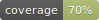

# Blackjack 21 simplified

### Architecture

This app follows Clean Dart architecture [proposed by Flutterando](https://github.com/Flutterando/Clean-Dart/blob/master/README.md).

Folder structure was higly inspired by [Clean Dart Login with Firebase, MobX and Modular](https://github.com/Flutterando/Clean-Dart/blob/master/README.md#:~:text=Clean%20Dart%20Login%20with%20Firebase%2C%20MobX%20and%20Modular) project.


## CI/CD

- Pull request to develop triggers "pr-checks" pipeline, which will run a static code analysis and run all tests
- Push to develop triggers "stg-build" pipeline, which will run a static code analysis, run all tests, deploy the android app on Firebase app Distribution and deploy the web app on Firebase Hosting, using Firebase staging project.
- Push to main triggers "prod-release" pipeline, which will run a static code analysis, run all tests, deploy the android app on Firebase app Distribution and deploy the web app on Firebase Hosting, using Firebase prod project. The pipeline will also generate a new GitHub release with all needed assets.

# Testing on each environment

- Android app staging: https://appdistribution.firebase.dev/i/0c917e55474139df
- Web app staging: https://blackjack21-stg.web.app

- Android app production: https://appdistribution.firebase.dev/i/6b6c3da51ecf3a97
- Web app production: https://blackjack21-prod.web.app

# Run the app
For running the app app make sure to first run
```
make clean
make gen-code
```

To run the staging app:
```
flutter run --flavor stg -t lib/main_stg.dart
```

To run the production app:
```
flutter run --flavor prod -t lib/main_prod.dart
```

## boot.dart

- Initialization and startup logic should be done here.
- Initalize locators, SDKs, etc.
- Called by all Flavors.

## main_<flavor>.dart

- Entry point for each Flavor of the app
- There is one Flavor per environment (stg, prod)
